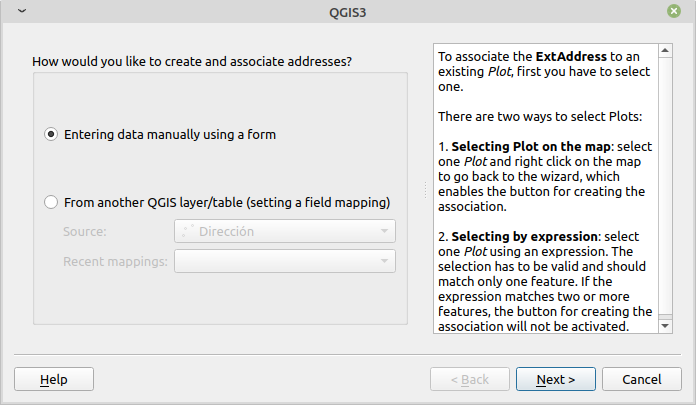
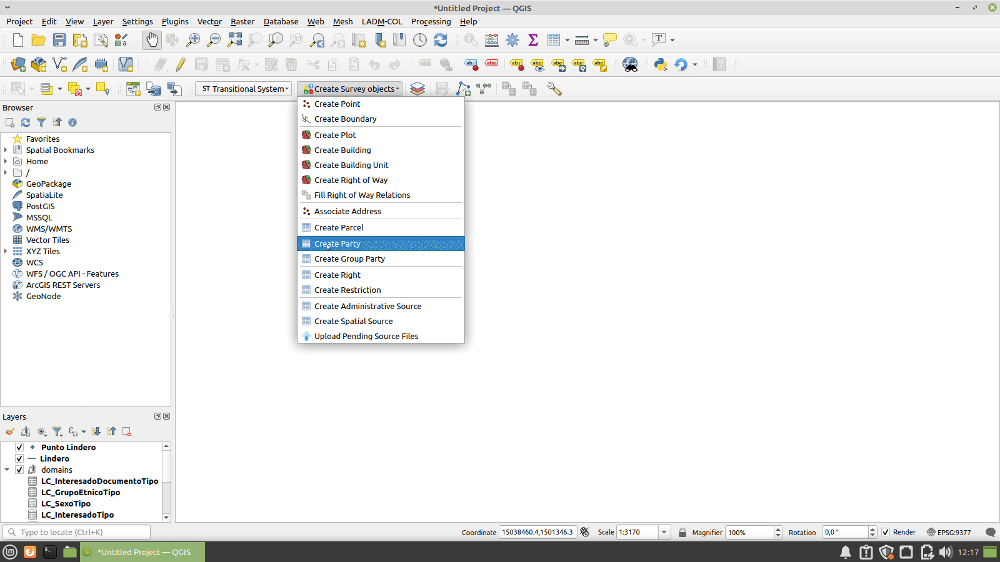
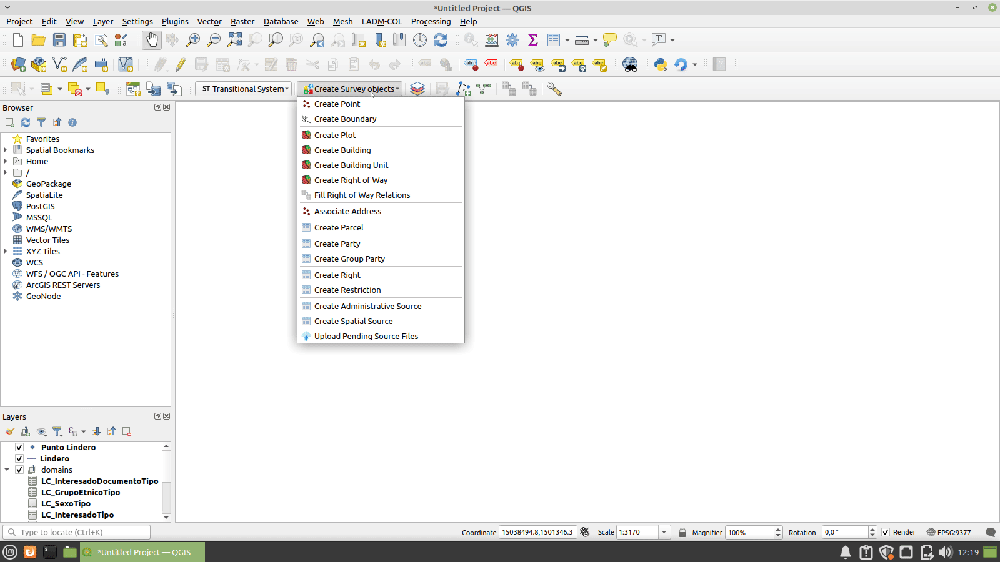
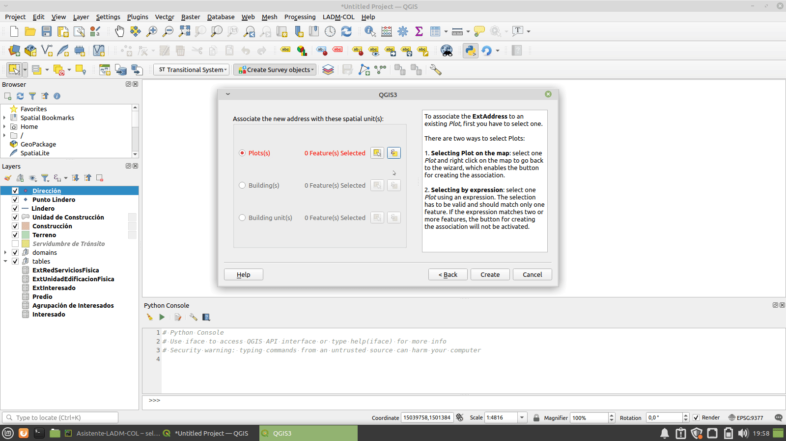

# Creación de features

En los wizards hay 2 formas de crear un feature:

- Manualmente, gestionado por la familia de clases ```ManualFeatureCreator```
- Usando refactor fields, gestionado por la clase ```RefactorFieldsFeatureCreator```



## ManualFeatureCreator

Esta clase gestiona la creación de un feature. Es abstracta.

```mermaid
classDiagram
%% abstract class
class ManualFeatureCreator{
__init__(iface, app, logger, layer, feature_name)
create()
disconnect_signals()
}
class AlphaFeatureCreator
class SpatialFeatureCreator{
save_created_geometry()
}
ManualFeatureCreator <-- AlphaFeatureCreator
ManualFeatureCreator <-- SpatialFeatureCreator
```

**Clases hijas:**

- AlphaFeatureCreator
- SpatialFeatureCreator

**Señales:**

- ```form_rejected``` es emitida cuando el formulario del feature (ver imagen de AlphaFeatureCreator) ha sido cerrado sin completar el proceso exitosamente.
- ```exec_form_advanced``` se emite después de que el formulario del feature se cerró de forma exitosa y antes de que se aplique el commit a la capa del feature. Se utiliza para hacer modificaciones al feature (por ejemplo, asociar otros feature) antes de guardarlo.
- ```finish_feature_creation```, emitida cuando se le aplicó el commit a la capa correctamente.

### AlphaFeatureCreator

Gestiona la creación de un feature alfanumérico. Cuando se invoca el método ```create```, prepara la capa para dejarla en modo edición y despliega el formulario asociado al nuevo feature. Una vez que el usuario diligencia el formulario correctamente, le aplica un commit a la capa. A continuación, el diagrama de flujo del método ```create```.

```mermaid
flowchart LR
i([ ]) -->
a0[prepara la capa] --> a[abre formulario] --> a1[/usuario ingresa info/] --> b{el formulario se cerró con éxito?}
b --si--> c[SEÑAL exec_form_advanced] --> e[commit a la capa] --> f[SEÑAL finish_feature_creation] 
--> fin2([ ])
b --no--> m[SEÑAL form_rejected]
--> fin([ ])
```



En la implementación mostrada en la imagen anterior, el método *create* es invocado cuando se hace clic en el botón **create** del wizard.

### SpatialFeatureCreator

Gestiona la creación de un feature espacial. Cuando se invoca el método ```create```, prepara la capa para dejarla en modo edición, pero a diferencia de *AlphaFeatureCreator*, activa la entrada de geometrías, como se puede ver en el siguiente diagrama:

```mermaid
flowchart LR
i([ ]) -->
a0[prepara la capa] --> a1[activa entrada de geometrías] --> a2[/usuario ingresa geometría/]
--> f([ ])
```

Para salvar la geometría y continuar con la creación del feature, se debe invocar el método ```save_created_geometry```: este verifica que la geometría sea válida y tenga un solo feature, y despliega el formulario asociado al nuevo feature. Una vez el formulario es diligenciado correctamente, aplica un commit a la capa. A continuación, se presenta el diagrama de flujo del método ```save_created_geometry```

```mermaid
flowchart LR
i([ ]) -->
s1{geometría válida?} -- sí --> s2[SEÑAL valid_features_digitized]
s1 -- no --> s3[SEÑAL unexpected_features_digitized] --> fin2([ ])
s2 --> a[abre formulario] --> a1[/usuario ingresa info/] --> b{el formulario se cerró con éxito?}
b --si--> c[SEÑAL exec_form_advanced] --> e[commit a la capa] --> f[SEÑAL finish_feature_creation] --> fin([ ])
b --no--> m[SEÑAL form_rejected] --> fin3([ ])
```



En la implementación mostrada en la imagen anterior, el método ```create``` es invocado cuando se hace clic en el botón **create** del wizard y el método ```save_created_geometry``` es invocado cuando se hace clic en el botón de guardar.

**Señales:**

- ```unexpected_features_digitized```, es emitida por el método *save_created_geometry* cuando la geometría tiene más de un feature, ningún feature o la geometría es inválida.

- ```valid_features_digitized```, es emitida por el método *save_created_geometry* antes de desplegar el formulario del feature. Notifica que un feature válido fue digitalizado y permite hacer cambios al feature antes de guardarlo.

## RefactorFieldsFeatureCreator

Gestiona la creación de un feature a partir de refactor fields.

```mermaid
classDiagram
class RefactorFieldsFeatureCreator{
    __init__(app, db)
    create(selected_layer, editing_layer_name, field_mapping)
}
```

# Selección de features

Hay 2 clases para gestionar la selección de features en los wizard:

- La clase ```SelectFeaturesOnMapWrapper``` que gestiona la selección de features desde la selección directa de las geometrías.
- La clase ```SelectFeatureByExpressionDialogWrapper``` que permite seleccionar geometrías a partir de una expresión de filtrado.

## SelectFeaturesOnMapWrapper

```mermaid
classDiagram
class SelectFeaturesOnMapWrapper{
init_map_tool()
select_features_on_map(layer)
}
```

**Señales:**

- ```features_selected``` es emitida cuando se han seleccionado features.
  

- ```map_tool_changed``` es emitida cuando la herramienta de selección de features fue cambiada y se acepta el diálogo de advertencia.
  
  

## SelectFeatureByExpressionDialogWrapper

```mermaid
classDiagram
class SelectFeatureByExpressionDialogWrapper{
select_feature_by_expression(layer)
}
```

**Señales:**

- ```feature_selection_by_expression_changed``` es emitida cuando se han seleccionado features.

# Gestión de capas removidas

## LayerRemovedSignalsManager

Cuando una capa en *C* deja de existir, el objeto de *python* que envuelve(wrapper) dicha capa sigue teniendo un valor diferente de ```None``` y no hay forma de verificar que hace referencia a un objeto inexistente. Si se intenta acceder a la capa, lanzará una excepción. Para gestionar este comportamiento, la clase ```LayerRemovedSignalsManager``` toma un diccionario de capas en el constructor. Cada vez que una capa es removida, le asigna el valor ```None``` a la entrada del diccionario correspondiente a esa capa.

```mermaid
classDiagram
class LayerRemovedSignalsManager{
__init__(layers: dict)
connect_signals()
disconnect_signals()
reconnect_signals()
}
```

**Señales:**

- ```layer_removed``` es emitida cuando una capa es borrada y su correspondiente entrada del diccionario ha sido asignado el valor ```None```.
